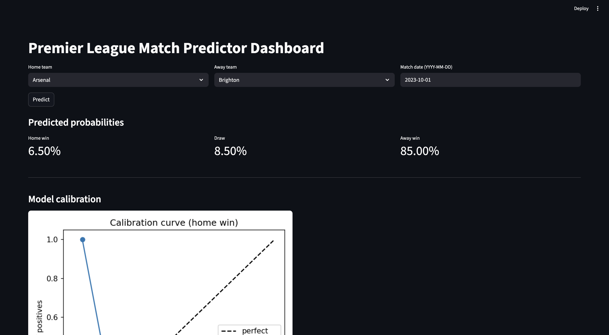

# Premier League Match Predictor

## Overview
This repository scaffolds a production-style machine learning project to predict Premier League match outcomes. The project separates research (notebooks) from production (`src/`), and is designed to be config-driven, modular, and testable.



The system predicts match outcome probabilities (home win, draw, away win) using rolling team statistics and Elo ratings, with a clean web interface for predictions and model calibration visualization.

## Setup
1. Create and activate a virtual environment:
   ```bash
   make venv && source .venv/bin/activate
   ```
2. Install dependencies:
   ```bash
   make install
   ```

## Project Structure (no Docker)
```
src/
  ingest/       # Data loading & cleaning from CSV/online sources
  features/     # Feature engineering (rolling stats, Elo, home advantage)
  models/       # Training & evaluation (RandomForest baseline, stubs for others)
  serve/        # FastAPI app and CLI for predictions
dashboard/      # Streamlit app (future)
notebooks/      # EDA only, no production code
tests/          # Unit/integration tests
configs/        # YAML configs for data paths and model params
```

## How to Run
- Train baseline model:
  ```bash
  make train
  ```
- Evaluate:
  ```bash
  make eval
  ```
- Start API:
  ```bash
  make api
  ```
- Start Dashboard:
  ```bash
  make dashboard
  ```

### Data preparation
```bash
make ingest   # aggregates EO/*.csv -> data/raw/matches.csv
make clean    # cleans -> data/processed/matches_clean.csv
make features # builds rolling+Elo features and time-based splits
```

### API usage example
```bash
curl -X POST http://localhost:8000/predict \
  -H 'Content-Type: application/json' \
  -d '{"home_team":"Arsenal","away_team":"Chelsea","match_date":"2023-10-01"}'
```

If the API is not running, the Streamlit app falls back to local inference.

## Testing
```bash
make test
```

## Future Work
- Implement full feature engineering (rolling windows, Elo, Poisson features)
- Add XGBoost, Poisson regression, and ensemble models
- Add data versioning, experiment tracking integrations and dashboards
- Optional: containerization if needed later (Docker, Kubernetes)


